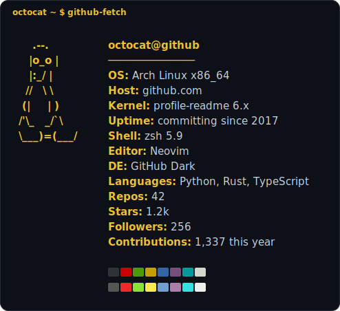

# github-fetch

> A [fastfetch](https://github.com/fastfetch-cli/fastfetch)-style GitHub profile card generator — no build step, no dependencies, no server.



Pick a distro logo, customise your fields, and export a pixel-perfect SVG to drop straight into your GitHub profile README. What you see in the browser is exactly what GitHub renders.

**[→ Try it live](https://vlasio.github.io/github-fetch)**

---

## Features

- **10 distro logos** — Arch, Ubuntu, NixOS, Debian, macOS, Windows, and more
- **Live preview** — edits update the card in real time
- **Export as SVG, Markdown code block, or plain text**
- **Import / export fields via CSV** — version-control your card data separately
- **Colour pickers** for logo and accent independently
- **Terminal colour blocks** (the classic 16-colour row) — optional toggle
- **Zero dependencies** — one HTML file, works fully offline

---

## Usage

### Quickest way

```
open index.html
```

### Host it yourself (GitHub Pages)

1. Fork this repo
2. Go to **Settings → Pages → Source → main / (root)**
3. Visit `https://vlasio.github.io/github-fetch`

---

## Adding the card to your GitHub profile

1. Open the app, customise your fields and colours
2. Click **Download SVG**
3. Create (or open) the special repo `your-username/your-username`
4. Commit the SVG file to that repo
5. In your profile `README.md`:

```markdown

```

> **Why SVG?** GitHub's markdown renderer strips CSS from `` tags and blocks most external resources — SVG is the only format that preserves colours and monospace layout inside a README.

---

## Customising via CSV

Fields can be bulk-edited outside the app. Export a CSV, edit it in any spreadsheet, and re-import:

```csv
label,value
OS,Arch Linux
Shell,zsh 5.9
Editor,Neovim
Languages,Python · Rust · TypeScript
```

---

## Browser support

| Browser | Status |
|---------|--------|
| Chrome / Edge / Opera | ✅ Full support |
| Firefox | ✅ Full support |
| Safari | ✅ Full support |

---

## License

MIT — do whatever you want with it. A star is appreciated if it saves you time. ⭐
